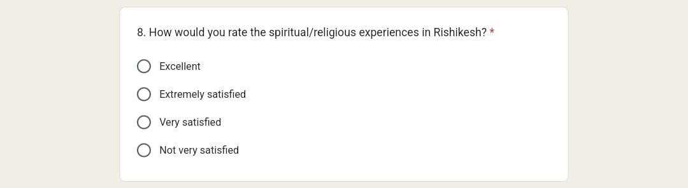
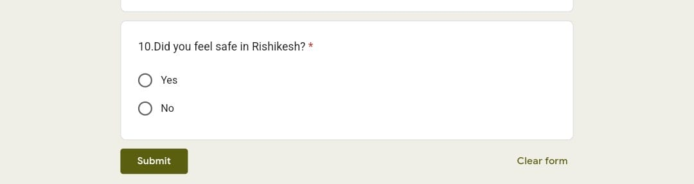

# Heading 

# Table of Contents

1. [ Overview  ](#overview)
2. [Purpose  ](#purpose)
3. [Target Audience ](#target-audience)
4. [ Prerequisites  ](#prerequisites)
5. [Procedure how to fill the Rishikesh form  ](#procedure-how-to-fill-the-rishikesh-form)
6. [Conclusion ](#conclusion)

## Overview 
The act of seeking feedback enables the gathering of opinions and perspectives from a wide range of audiences, contributing to the improvement of various subject types. It serves as a catalyst for growth and progress.

## Purpose 
The purpose of conducting the Rishikesh Trip Feedback survey was to gather participants' perspectives and insights related to their recent visit to Rishikesh. Through their feedback, the survey aimed to evaluate the trip's overall success and identify opportunities for future improvements.

## Target Audience  
Employee and contractor that attended the tripe Rishikesh location.

## Prerequisites 

-   Mobile/Laptops
-   Good internet connection
 

## Procedure how to fill the Rishikesh form  
Firstly, Click on this links: 
https://forms.gle/9ydx5UGqyDLtQ8D27 

 

### First step:

Enter the Name:

### Then,

 

### Then,
2.How would you rate the cleanliness of Rishikesh?

 

### Then,
3.How satisfied were you with your trip to Rishikesh?

 

### Than,
4.What was the primary purpose of your trip to Rishikesh?

 

### Than,
5. How would you rate the accommodations in Rishikesh?

 

### Than,
6. How would you rate the food options in Rishikesh?

  

### Then, 
7.Which adventure activities did you participate in?

 

### Than,
8. How would you rate the spiritual/religious experiences in Rishikesh?

### Than,
9. How would you rate the cleanliness of Rishikesh? 

### Than,
10.Did you feel safe in Rishikesh? 

 

## Conclusion
The fundamental aim of providing feedback for a Rishikesh trip is to empower individuals to articulate their journey in a comprehensive manner, sharing valuable observations, enlightening anecdotes, and beneficial recommendations for prospective travellers. By doing so, feedback plays a crucial role in facilitating effective trip preparation and ensuring that others are well-informed about the intricacies of travelling to Rishikesh.